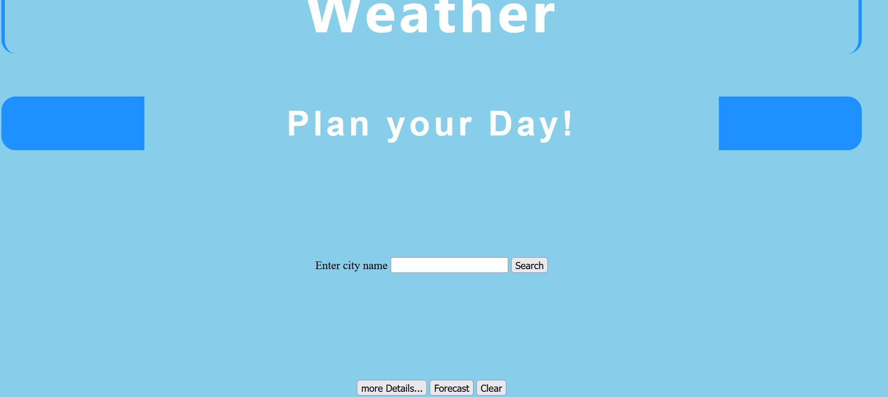

# jsd-final-project (A Weather API)

[nisha/jsd-final-project](https://nisha1239.github.io/jsd-final-project/)

### With this API you can retrieve current weather observations and localised weather forecasts from live weather stations. You can access different weather data by searching for a city name.

## Current Weather
### Current weather observations for any location from over 50.000 stations worldwide including temperature with weather condition, UV Index, Visibility, Air Quality Index and lots more...

## Weather Forecasts
### Shows up weather forecasts for 16 day/ daily basis for any location in the world including minimum and maximum temperature.

## Final look of the API
--------------------------

## Results data after making a search for a city
-------------------------------------------------

## Hurdles:
### Inserting icons relative to weather conditions
### Setting local time for the searching city for Sunrise and Sunset features

## Enjoyed every bit of New Learnings:
### There was a lot to learn. To sum up a few points - 
### (1) Browsing through a pool of information available from an API
### (2) Retrieving data and using it for various purpose
### (3) How to create a json query and log/ display the search result

## Future Features:
### (1) Work upon better look of the website
### (2) To add more search criteria like based on latitude / longitude, postcode etc.
### (3) To add features like Sunrise and Sunset Timings
### (4) To make it a responsive site
### (5) To add Alerts for severe weather conditions
### (6) To add feature like Feedback, suggestions, Q/A...

### Hope, it povides to cater all your needs...

